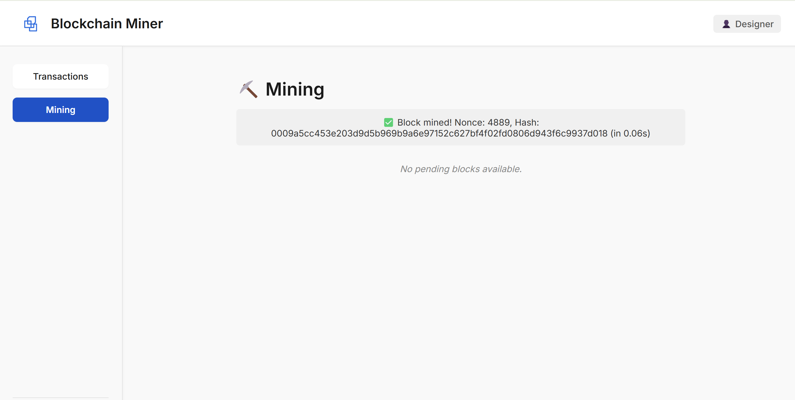

# Cryptocoin library - for educational purposes

Writing a blockchain system from scratch, with python fastapi backend, React TS frontend and a production layer using Docker and NGINX (SSL and reverse proxy).

How to run:
1. Generate certificates in the nginx/certs folder (using mkcert for example).
2. docker compose build
3. docker compose up

DISCLAIMER: NOT MEANT FOR PRODUCTION USE!!!

## Modules so far
* **backend**: python fastapi backend for validation and block organization
    * **app**: main app logic
        * **blockchain**: blockchain and crypto modules
            * **digital signature**
            * **hashing**
            * **block**
            * **blockchain**
        * **engine**: game engine, handling async actions
        * **models**: pydantic models for incoming requests
        * configs
        * main
    * **testing**
* **frontend**: React TS frontend for user actions
    * **src**
        * **assets**: logo
        * **components**: React components and their css
        * **context**: user context handler
        * **crypto**: cryptographic utilities, mirrors the backend more or less
        * **workers**: mining worker
        * App.tsx
        * index.tsx
* **nginx**: NGINX config and certificates
* docker related files: dockerfile, compose and dockerignore